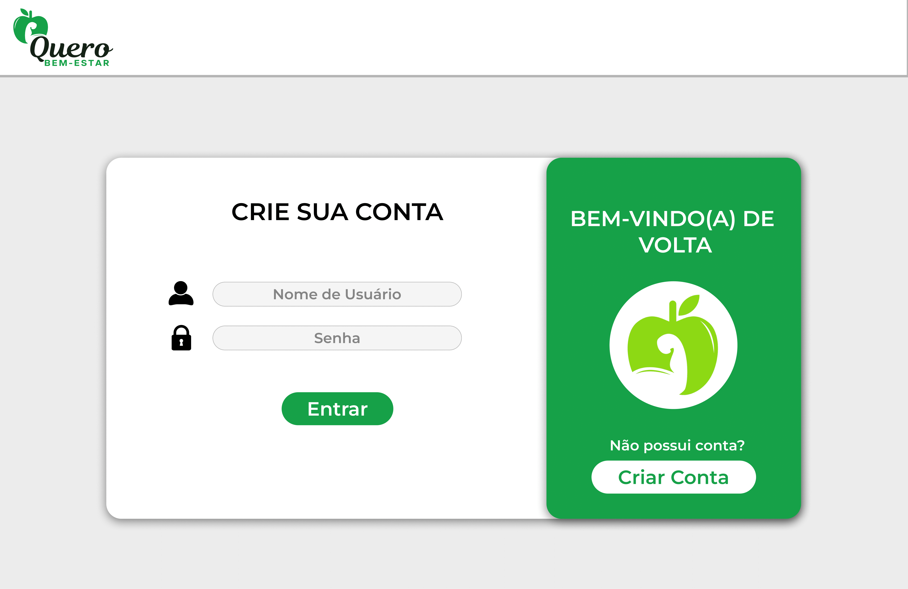
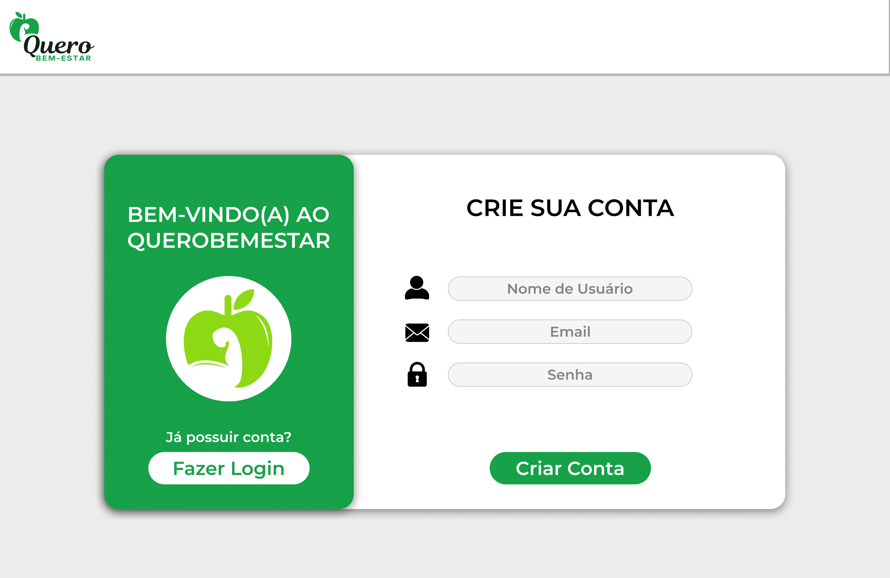
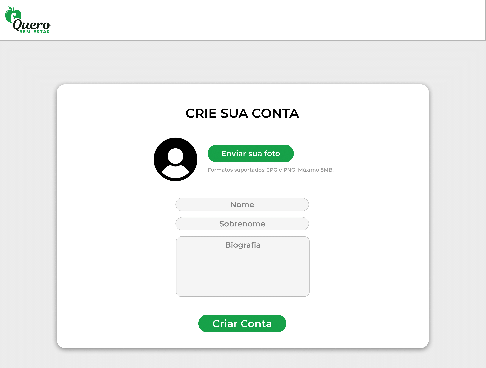
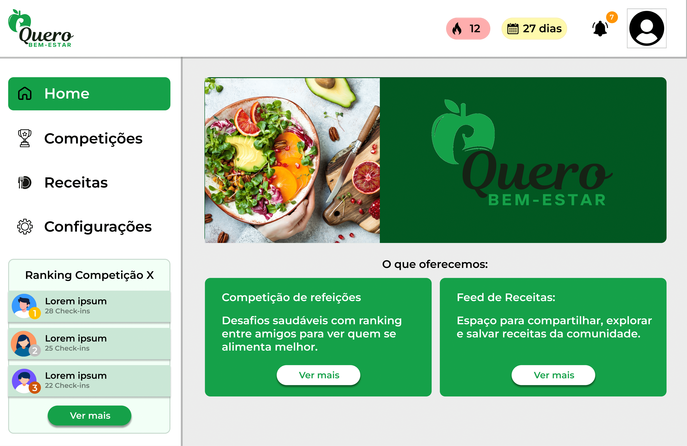
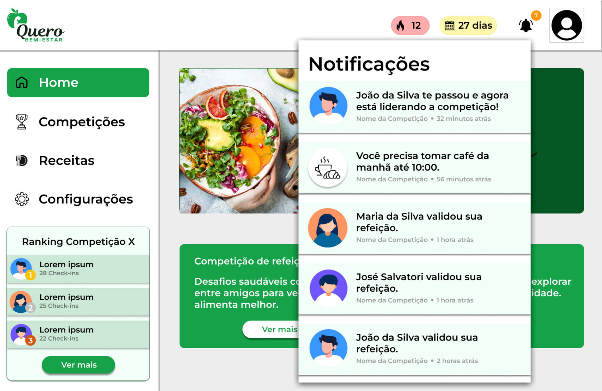
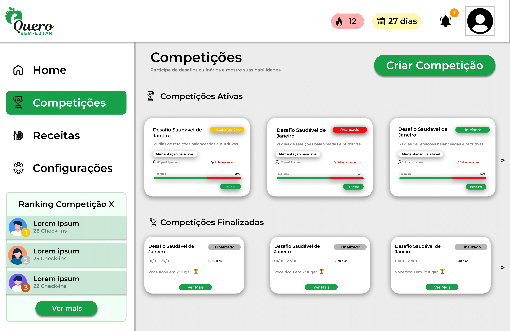
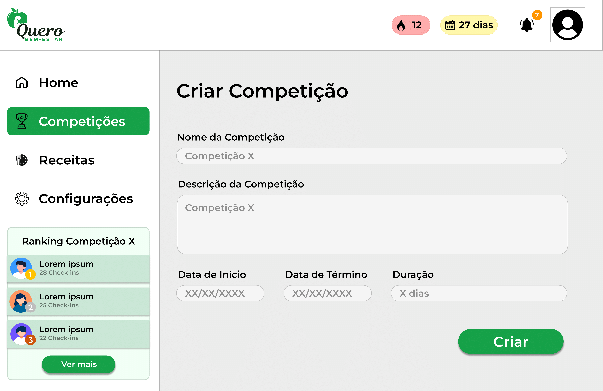
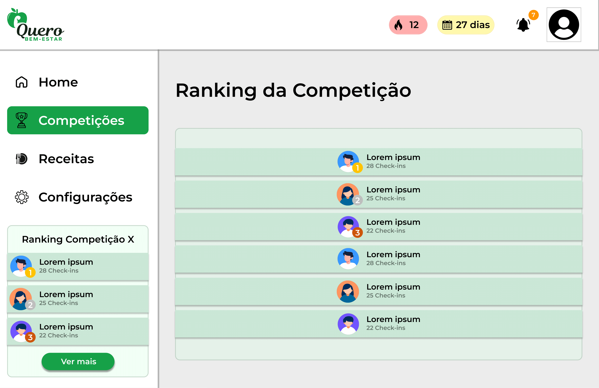
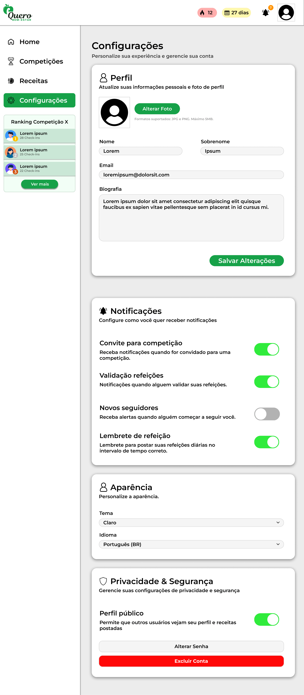

# Prototype
Nosso grupo desenvolveu um protótipo de alta fidelidade com o objetivo de ilustrar o funcionamento e a navegação da plataforma **Quero Bem-Estar**. O foco principal do projeto é incentivar hábitos saudáveis por meio da competição de refeições realizadas em determinados horários, tornando a experiência mais motivadora, acessível e funcional para usuários de diferentes perfis.

Para a criação dos protótipos, utilizamos a ferramenta Figma, que nos permitiu projetar e testar interfaces de forma colaborativa e eficiente. Com isso, conseguimos representar de forma fiel o fluxo de participação, as interações sociais e os principais recursos da plataforma.

# 1. Tela de Login
Permite ao usuário acessar a plataforma inserindo nome de usuário e senha.

# 2. Tela de Cadastro
Fluxo de criação de conta com inserção de nome de usuário, e-mail e senha.

## 2.1. Tela Cadastro

## 2.2. Tela Inserir Informações
 

# 3. Tela Home
Apresenta o painel inicial uma explicação básica de funcionalidades da aplicação.

## 3.2 Modal Notificações

# 4. Tela de Competições
Exibe a lista de competições ativas ou finalizadas e oferece a opção de criar uma nova competição.

## 4.1. Tela Competições Ativas/Finalizadas

## 4.2. Tela Criar Competição

## 4.3. Tela Dentro da Competição

## 4.4. Tela Ranking da Competição

# 5. Tela de Receitas
Feed interativo mostrando receitas de amigos, podendo curtir, comentar e salvar a receita.

# 6. Tela de Configurações
Permite personalizar preferências do usuário e ajustar dados da conta.

--- 

# Protótipo no Figma
Confira o protótipo interativo no Figma.

<iframe style="border: 1px solid rgba(0, 0, 0, 0.1);" width="800" height="450" src="https://embed.figma.com/design/43vqTOVGOI2QULKGABcyHp/QueroBemEstar?node-id=0-1&embed-host=share" allowfullscreen></iframe>

<b>Autores:</b> 
<a href="https://github.com/leohssjr" target="_blank">Leonardo Henrique Sobral Sauma Junior</a>, 
<a href="https://github.com/MylenaTrindade" target="_blank">Mylena Trindade Mendonça</a>. 2025

## Histórico de Versão

| Versão | Data | Descrição | Autor(es) |
| :-: | :-: | :-: | :-: |
| `1.0` | 03/09/2025  | Criação do Documento | [Leonardo Henrique Sobral Sauma Junior][leohssjr] |

[Arturhk05]: https://github.com/Arturhk05  
[eduardoferre]: https://github.com/eduardoferre  
[fbressa]: https://github.com/fbressa  
[SAnjos3]: https://github.com/SAnjos3  
[JoaoPedro2206]: https://github.com/JoaoPedro2206  
[JoseViniciusQueiroz]: https://github.com/JoseViniciusQueiroz  
[leohssjr]: https://github.com/leohssjr  
[marcomarquesdc]: https://github.com/marcomarquesdc  
[MylenaTrindade]: https://github.com/MylenaTrindade  
[yagoas]: https://github.com/yagoas